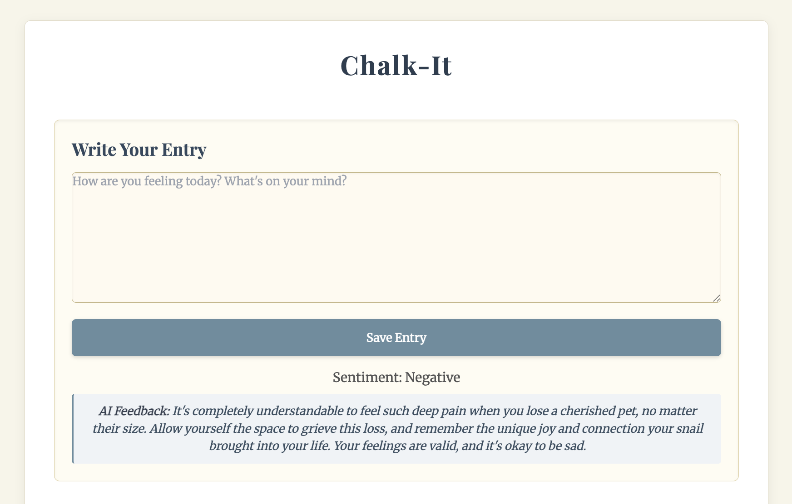

## Chalk-It
Chalk-It is a personal digital journal. It enhances self-reflection by using AI to provide sentiment analysis and empathetic feedback on your written entries, all securely stored and accessible in the cloud via Firebase.

To use it you will need to use your own gemini API key and firbase config.

## Example1

## Example2

## Example3

